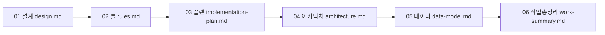

# PropLanding 문서 허브

모든 문서는 **클릭 한 번으로 이동**할 수 있도록 상호 링크되어 있습니다.  
코딩 착수 전 아래 순서로 읽는 것을 권장합니다.

---

## 문서 목록

| # | 문서 | 내용 | 바로가기 |
|---|------|------|----------|
| 01 | **설계서** | 화면·그래픽·클릭 흐름, 저작권 회피 개선안 | [design.md](./design.md) |
| 02 | **개발 룰** | 코딩·디자인·운영·저작권 규칙 | [rules.md](./rules.md) |
| 03 | **구현 플랜** | 8단계 코딩 로드맵, 안정성·확장성·효율성 | [implementation-plan.md](./implementation-plan.md) |
| 04 | **아키텍처** | 시스템·서비스·퍼널 구조 | [architecture.md](./architecture.md) |
| 05 | **데이터 모델** | DB 스키마·관계·PII | [data-model.md](./data-model.md) |
| 06 | **작업 총정리** | 전체 산출물·의사결정·체크리스트 | [work-summary.md](./work-summary.md) |

---

## 핵심 원칙 (한눈에)

| 원칙 | 적용 문서 |
|------|-----------|
| **그래픽 우선** — 분양은 시각이 전환을 만든다 | [design.md §2](./design.md#2-그래픽-우선-설계-graphics-first) |
| **클릭 연결** — 모든 항목·CTA·메뉴는 목적지가 있다 | [design.md §3](./design.md#3-클릭-연결-맵-click-through-map) |
| **저작권 안전** — 아이디어는 공통, 표현은 독자 | [rules.md §1](./rules.md#1-저작권-및-표현-규칙) |
| **안정성** — 장애 복구·백업·모니터링 | [implementation-plan.md §4](./implementation-plan.md#4-단계별-코딩-로드맵-8단계) |
| **확장성** — 추가·수정·삭제·업데이트 용이 | [architecture.md §6](./architecture.md#6-시스템-아키텍처) |
| **효율성** — 재사용 템플릿·자동화·캐시 | [implementation-plan.md §3](./implementation-plan.md#3-비기능-요구사항-설계-기준) |

---

## 코딩 단계 요약

총 **8단계**로 나누어 개발합니다. 상세는 [implementation-plan.md](./implementation-plan.md)를 참고하세요.

| 단계 | 명칭 | 핵심 |
|------|------|------|
| 0 | 기반 구축 | 저장소·CI/CD·인프라·관측 |
| 1 | Site Factory 코어 | 템플릿·캠페인 CRUD·미디어 파이프라인 |
| 2 | 공개 랜딩 (그래픽) | 모바일 퍼스트·갤러리·평면·고정 CTA |
| 3 | 전환·문의 | 폼·동의·클릭 흐름 완결 |
| 4 | Control Tower | 관리자·문의·상태·배정 |
| 5 | 일정·영업 | 예약·상담·파이프라인 |
| 6 | Attribution | UTM·이벤트·리포트 |
| 7 | 안정화·운영 | DR·성능·보안·사후관리 |
| 8 | 지능 보조 (선택) | AI·스코어링 |

---

*문서 버전: 1.0 · [프로젝트 README](../README.md)*
