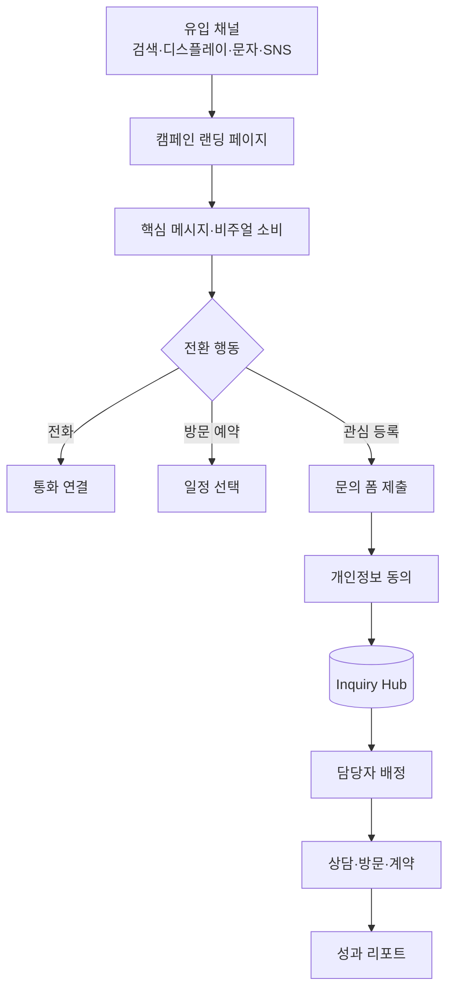
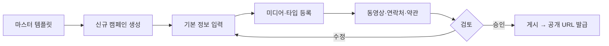
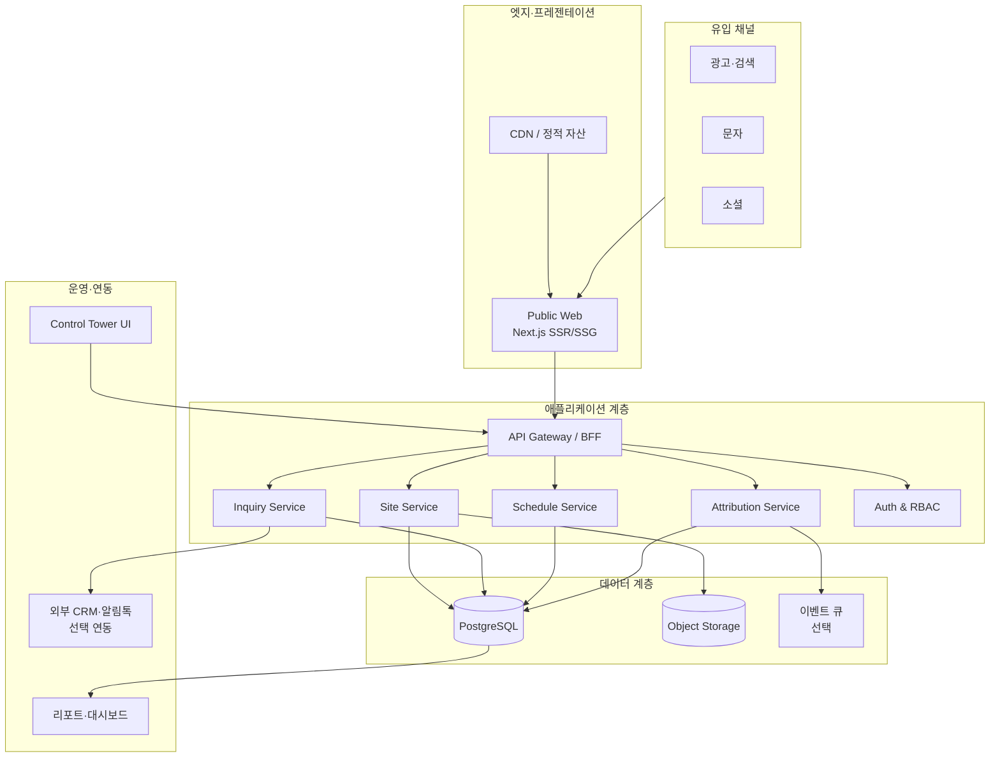
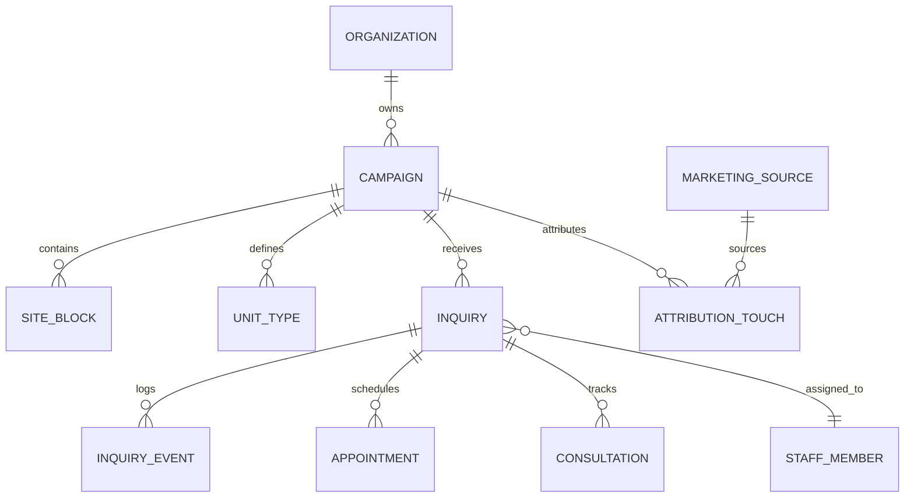
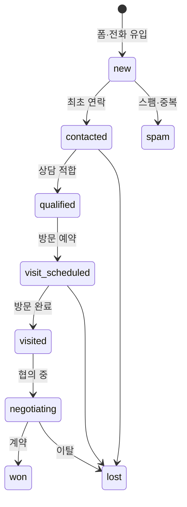

# PropLanding — 캠페인 랜딩 & 영업운영 플랫폼 설계서

> **문서 목적**  
> 분양·프로모션용 단일 랜딩 페이지를 반복 제작하는 방식에서 벗어나,  
> **캠페인별 페이지 생성 → 잠재고객 수집 → 상담·예약 운영 → 성과 측정**을 하나의 플랫폼으로 통합하기 위한 독자 설계 문서입니다.  
> 업계 공통 패턴(랜딩 퍼널, CRM, UTM 추적 등)을 참고하되, 특정 외부 사이트의 문구·화면·구조를 복제하지 않습니다.

---

## 1. 제품 비전

### 1.1 배경

부동산 분양·프로모션 영업에서는 캠페인마다 별도 랜딩 페이지가 필요합니다.  
페이지 자체가 목적이 아니라, **유입 → 관심 표명 → 상담·방문 → 계약**까지 이어지는 운영 흐름을 지원하는 것이 핵심입니다.

### 1.2 제품 정의

| 구성 요소 | 역할 |
|-----------|------|
| **Site Factory** | 캠페인(사업) 단위 랜딩 페이지를 템플릿 기반으로 생성·배포 |
| **Inquiry Hub** | 잠재고객 문의·등록·상태 전환을 관리하는 영업 허브 |
| **Schedule Desk** | 방문·상담 예약 일정 및 담당자 배정 |
| **Attribution Layer** | 광고·채널 유입 경로와 전환 성과를 기록·분석 |
| **Control Tower** | 운영자·관리자용 웹 콘솔 |

**최종 목표:** 분양 홈페이지 제작 도구가 아닌, **영업 운영 자동화 플랫폼(Sales Operations Platform)**.

### 1.3 설계 원칙

1. **모바일 우선** — 유입 트래픽의 대부분이 모바일이다.
2. **전환 경로 단순화** — 전화·예약·문의까지 최소 탭 수.
3. **콘텐츠와 로직 분리** — HTML 수작업이 아닌 데이터 기반 페이지 생성.
4. **이벤트 중심 추적** — 행동 로그를 상담 우선순위 판단에 활용.
5. **단계적 확장** — MVP → CRM → 분석 → AI 순으로 범위를 넓힌다.
6. **개인정보 최소 수집** — 목적·보유 기간·동의 항목을 명시한다.

---

## 2. 사용자 여정 (Visitor Funnel)

방문자가 페이지에 도달한 뒤 영업 파이프라인에 편입되기까지의 표준 흐름입니다.



이 구조는 일반적인 **리드 제너레이션(Lead Generation) 퍼널**이며, 기업 홈페이지 CMS와는 목적이 다릅니다.  
프론트는 전환에, 백오피스는 후속 영업에 집중합니다.

---

## 3. 공개 페이지 (Public Site) 기능 명세

### 3.1 캠페인 랜딩

- 캠페인(사업)마다 독립 URL·메타 정보 제공 (`/c/{slug}` 형태 권장)
- 핵심 분양·프로모션 메시지, 모바일 레이아웃 기본
- 스크롤 구간별 정보 블록: 히어로, 갤러리, 동영상, 평면·타입, 위치·FAQ 등

### 3.2 고정 전환 바 (Persistent Action Bar)

스크롤 위치와 무관하게 노출되는 액션:

| 액션 | 설명 |
|------|------|
| 전화 연결 | `tel:` 링크, 원터치 발신 |
| 방문 예약 | 예약 모달 또는 전용 섹션으로 이동 |
| 상담 요청 | 문의 폼 또는 카카오·채널톡 등 외부 상담 링크 |
| 관심 등록 | 최소 필드(이름·연락처·희망 일시) 수집 |

### 3.3 미디어·타입 블록

- 대표 이미지, 슬라이드 갤러리, 확대 보기
- 임베드 또는 스트리밍 동영상
- **유닛 타입(Unit Type)** 단위 등록: 평면도, 전용면적, 가격·혜택 요약
- 타입별 클릭·체류 이벤트를 Attribution Layer에 기록

### 3.4 문의·등록 (Inquiry Capture)

수집 필드 예시: 이름, 연락처, 희망 방문 일시, 관심 타입(선택), 메모  
필수: 개인정보 수집·이용 동의(버전·시각 저장)  
제출 시 Inquiry Hub에 레코드 생성, 필요 시 담당자 자동 배정 규칙 실행

---

## 4. 운영 콘솔 (Control Tower)

관리자 화면은 **도메인별 메뉴**로 구성합니다. (외부 사이트 메뉴 구조와 무관한 독자 IA)

```text
Control Tower
├── 대시보드          … 오늘 유입·신규 문의·예약·전환 요약
├── 캠페인(Sites)
│   ├── 목록 / 생성·수정
│   ├── 기본 정보     … 명칭, slug, 연락처, 노출 기간
│   ├── 콘텐츠 블록   … 섹션 순서, 텍스트, CTA 문구
│   ├── 미디어        … 이미지·동영상 업로드
│   ├── 유닛 타입     … 평면·스펙
│   └── 미리보기·게시 … draft / published 상태
├── 잠재고객(Inquiries)
│   ├── 전체 / 신규 / 상담중 / 방문완료 / 계약
│   ├── 상세·활동 이력
│   └── 담당자 배정
├── 일정(Schedule)
│   ├── 방문·상담 예약 캘린더
│   └── 상담 기록
├── 마케팅(Attribution)
│   ├── 캠페인·UTM 규칙
│   └── 채널·소재별 성과
├── 리포트
│   └── 캠페인·기간·담당자별 KPI
└── 시스템
    ├── 조직·테넌트
    ├── 관리자·역할(RBAC)
    └── 감사 로그
```

### 권장 핵심 화면 (MVP 이후 우선순위)

1. 캠페인 목록  
2. 캠페인 생성·수정 마법사  
3. 랜딩 미리보기  
4. 잠재고객 목록·필터  
5. 잠재고객 상세·타임라인  
6. 예약 관리  
7. 담당자 배정  
8. 캠페인별 통계  
9. UTM·광고 캠페인 설정  
10. 관리자·권한

---

## 5. Site Factory — 콘텐츠 생산 흐름

개발자가 매번 HTML을 수정하지 않도록 **템플릿 + 데이터** 모델을 사용합니다.



운영자는 동일한 레이아웃 골격 위에 캠페인별 콘텐츠만 교체합니다.  
외주·SaaS 확장 시 **마스터 템플릿 1종 + 콘텐츠 입력** 반복이 핵심 가치입니다.

---

## 6. 시스템 아키텍처

### 6.1 논리 구성



### 6.2 서비스 경계

| 서비스 | 책임 |
|--------|------|
| **Site Service** | 캠페인 메타, 섹션·블록, 게시 상태, 공개 API |
| **Inquiry Service** | 문의 생성, 상태 머신, 담당자 배정, 중복 탐지 |
| **Schedule Service** | 예약 슬롯, 상담 기록, 알림 트리거 |
| **Attribution Service** | 세션·페이지뷰·커스텀 이벤트, UTM 파싱 |
| **Auth** | 조직·관리자 인증, 역할 기반 접근 제어 |

초기 MVP에서는 **모놀리식 API + 모듈 분리**로 시작하고, 트래픽·팀 규모에 따라 서비스 분리를 검토합니다.

### 6.3 권장 기술 스택 (참고안)

| 영역 | 후보 | 비고 |
|------|------|------|
| Public Web | Next.js (App Router) | SEO·성능·미리보기 |
| Admin UI | React + 동일 백엔드 API | 또는 Next.js admin 앱 분리 |
| API | Node(NestJS) 또는 Go/FastAPI | 팀 역량에 따름 |
| DB | PostgreSQL | 관계형·JSONB 블록 저장 |
| 파일 | S3 호환 Object Storage + CDN | 이미지·동영상 |
| 인증 | JWT + Refresh / 세션 | RBAC는 DB 역할 테이블 |
| 배포 | Git CI/CD, 컨테이너 | 스테이징·프로덕션 분리 |

최종 스택은 인력, 트래픽, 비용, 호스팅 환경을 기준으로 결정합니다.

---

## 7. 데이터 모델 개요

상세 DDL은 [`data-model.md`](./data-model.md)를 참고하세요.  
핵심 엔티티 관계만 요약합니다.



**계층:** `Organization`(테넌트) → `Campaign`(사업·캠페인) → `Inquiry`(잠재고객)  
한 플랫폼에서 여러 분양대행사·시행사·건설사가 데이터가 격리된 채 사용할 수 있도록 **조직 단위 멀티테넌시**를 전제합니다.

---

## 8. 방문자·행동 추적 (Attribution Layer)

상담원이 잠재고객의 관심도를 판단할 수 있도록 **최소必要 이벤트**를 수집합니다.

### 8.1 수집 이벤트 예시

| 이벤트 | 용도 |
|--------|------|
| `session_start` | 유입 시각, referrer, UTM |
| `page_view` | 섹션·타입 페이지 조회 |
| `unit_type_view` | 관심 평형·타입 |
| `media_play` | 동영상 재생·완료율 |
| `cta_click` | 전화·예약·문의 버튼 |
| `form_submit` | 관심 등록 완료 |

### 8.2 잠재고객 360° 뷰 (운영자 화면 예시)

```text
Inquiry #A-2026-00482
─────────────────────────────────────
유입: 네이버 검색광고 / 캠페인: spring_launch_q3
관심 타입: 84㎡ A → 101㎡ B (변경 이력)
체류: 5분 12초 | 영상 시청: 68%
문의: 0회 | 방문 예약: 2026-08-20 15:00
담당: 김○○ (자동 배정)
```

### 8.3 개인정보·컴플라이언스

- 광고 ID, 쿠키, IP 등은 **수집 목적·법적 근거·보유 기간**을 정책 문서에 명시
- 동의 없는 민감 정보 확대 수집 금지
- 이벤트 로그는 Inquiry와 연결 시 **가명·최소화** 원칙 적용

---

## 9. 잠재고객 상태 머신 (Inquiry Lifecycle)



상태 전환마다 `inquiry_events`에 감사 가능한 이력을 남깁니다.

---

## 10. 기능 로드맵

### Phase 1 — MVP (랜딩 + 기본 운영)

- Site Factory: 템플릿 1종, 캠페인 CRUD, 게시
- 공개 페이지: 모바일 레이아웃, 고정 CTA, 관심 등록, 개인정보 동의
- Control Tower: 캠페인·문의 목록, 기본 DB
- 인증: 관리자 로그인

### Phase 2 — 영업 운영

- Inquiry Hub: 상태 관리, 담당자 배정, 상담 기록
- Schedule Desk: 방문·상담 예약
- 중복 고객 탐지(연락처·캠페인 기준)
- 기본 통계(신규·전환·담당자별)

### Phase 3 — 마케팅 분석

- UTM·캠페인 파라미터 표준화
- 채널·소재·랜딩별 전환율
- 캠페인·기간별 리포트

### Phase 4 — 지능형 보조 (선택)

> CRM·이벤트 데이터가 안정된 **이후** 단계적으로 도입합니다.

- 문의 유형 자동 분류
- 상담 요약·메모 보조
- 관심 상품·타입 추론
- 리드 스코어링·우선순위 큐
- 영업 알림·후속 액션 제안

---

## 11. MVP 대비 기능 매트릭스

| 영역 | MVP 포함 | Phase 2+ |
|------|----------|----------|
| 모바일 우선 UI | ✓ | |
| 고정 CTA·원터치 전화 | ✓ | |
| 이미지·슬라이드·동영상 | ✓ | |
| 유닛 타입·평면 | ✓ | 확대·비교 |
| 관심 등록·동의 | ✓ | |
| 캠페인별 URL | ✓ | |
| 카카오·지도·FAQ | | ✓ |
| 담당자 자동 배정 | | ✓ |
| UTM·전환 분석 | | ✓ |
| AI 보조 | | Phase 4 |

---

## 12. 외주·제품화 관점

반복 납품을 위해 다음을 표준화합니다.

1. **마스터 템플릿** — 레이아웃·컴포넌트 고정  
2. **캠페인 설정 스키마** — JSON/DB로 콘텐츠 주입  
3. **운영 API·콘솔** — 캠페인마다 재사용  
4. **멀티테넌트** — 고객사(조직) 단위 격리  

동일 엔진으로 학원·병원·이커머스 프로모션 등 **고전환 랜딩이 필요한 업종**으로 확장 가능합니다.

---

## 13. 결론

- 공개 페이지는 **전환(Conversion)** 에, 백오피스는 **운영(Operations)** 에 최적화한다.  
- 목표 문장: *「캠페인별 랜딩을 빠르게 만들고, 잠재고객을 CRM 파이프라인까지 연결하는 시스템」*  
- 1차 목표는 랜딩 + 문의·예약 운영(MVP)이며, 분석·AI는 데이터 기반이 갖춰진 뒤 확장한다.

---

## 부록 A. 용어 대조 (저작권 회피를 위한 독자 명명)

| 일반적 표현 | 본 설계 용어 |
|-------------|--------------|
| 프로젝트 랜딩 | 캠페인 사이트 (Campaign Site) |
| 관심고객 | 잠재고객 (Inquiry) |
| 상담 고객 DB | Inquiry Hub |
| 프로젝트 CMS | Site Factory |
| 방문자 추적 | Attribution Layer |
| 관리자 | Control Tower |

---

*문서 버전: 1.0 · PropLanding Lab · 독자 작성*
