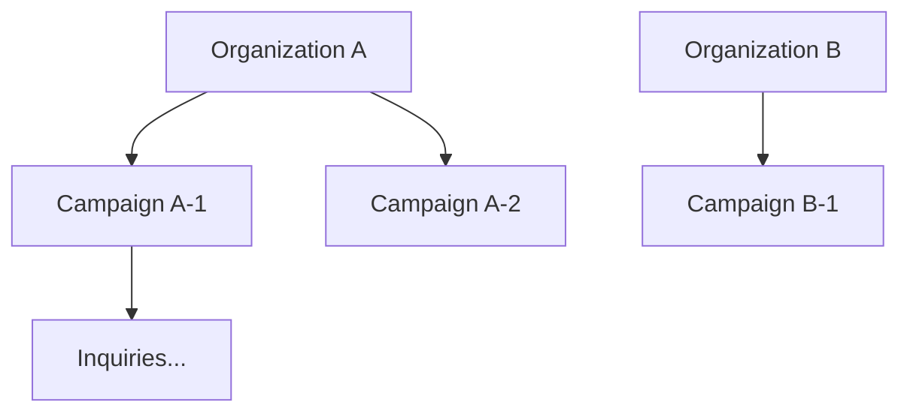

# PropLanding — 데이터 모델 상세

> 관련 문서: [문서 허브](./README.md) · [설계](./design.md) · [플랜](./implementation-plan.md) · [아키텍처](./architecture.md)

본 문서는 [`architecture.md`](./architecture.md)의 데이터 계층을 구체화합니다.  
테이블·컬럼명은 업계 관례와 독자 명명 규칙을 혼합했으며, 특정 외부 서비스 스키마를 복제하지 않습니다.

---

## 1. 명명 규칙

- 테이블: `snake_case`, 복수형
- PK: `id` (UUID v7 또는 BIGSERIAL — 팀 정책에 따름)
- FK: `{entity}_id`
- 시각: `created_at`, `updated_at` (timestamptz, UTC)
- 소프트 삭제: `deleted_at` (필요 테이블만)

---

## 2. 멀티테넌시

모든 비즈니스 테이블은 `organization_id`로 격리합니다.



---

## 3. 테이블 목록

### 3.1 조직·인증

| 테이블 | 설명 |
|--------|------|
| `organizations` | 테넌트(분양대행·시행·건설사 등) |
| `staff_members` | 조직 소속 운영·영업 인력 |
| `admin_users` | 콘솔 로그인 계정 (`staff_member_id` nullable) |
| `roles` | 역할 정의 (owner, manager, agent, viewer) |
| `admin_user_roles` | 계정-역할 N:M |

### 3.2 캠페인·사이트 (Site Factory)

| 테이블 | 설명 |
|--------|------|
| `campaigns` | 캠페인(사업) 마스터: slug, title, status, contact_phone |
| `site_templates` | 마스터 템플릿 메타 (layout_key, version) |
| `site_blocks` | 캠페인별 섹션: type, sort_order, payload(JSONB) |
| `media_assets` | 이미지·동영상 메타 (storage_key, mime, alt) |
| `campaign_media` | 캠페인-미디어 연결, 용도(hero, gallery, …) |
| `unit_types` | 평형·타입: code, name, area_sqm, specs(JSONB) |
| `unit_type_media` | 타입별 평면도 등 |
| `legal_notices` | 개인정보·마케팅 동의 문구 버전 |
| `campaign_legal_notices` | 캠페인에 적용된 약관 스냅샷 |

**`campaigns.status`:** `draft` | `published` | `archived`

**`site_blocks.type` 예:** `hero`, `gallery`, `video`, `unit_types`, `cta`, `faq`, `location`, `raw_html`(최소 사용)

### 3.3 잠재고객·영업 (Inquiry Hub)

| 테이블 | 설명 |
|--------|------|
| `inquiries` | 잠재고객 마스터 |
| `inquiry_events` | 상태·활동 타임라인 |
| `inquiry_consents` | 동의 항목·버전·시각 |
| `consultations` | 상담 기록 (channel, note, outcome) |
| `appointments` | 방문·상담 예약 |
| `contracts` | 계약 체결 (optional, Phase 2+) |
| `assignment_rules` | 자동 배정 규칙 (round_robin, load_balance) |
| `inquiry_assignments` | 배정 이력 |

**`inquiries.status`:** `new` | `contacted` | `qualified` | `visit_scheduled` | `visited` | `negotiating` | `won` | `lost` | `spam`

### 3.4 마케팅·추적 (Attribution Layer)

| 테이블 | 설명 |
|--------|------|
| `marketing_sources` | 채널 정의 (naver, google, sms, organic) |
| `utm_campaigns` | UTM 조합·내부 캠페인 코드 |
| `visitor_sessions` | 익명 세션 (first_touch UTM, device) |
| `attribution_touches` | 세션-캠페인 연결 |
| `analytics_events` | 이벤트 스트림 (name, properties JSONB) |

### 3.5 시스템

| 테이블 | 설명 |
|--------|------|
| `audit_logs` | 관리자 행위 감사 |
| `api_keys` | 외부 연동용 (선택) |

---

## 4. 핵심 관계

```text
organizations
  └── campaigns
        ├── site_blocks, unit_types, campaign_media
        ├── inquiries
        │     ├── inquiry_events, inquiry_consents
        │     ├── consultations, appointments, contracts
        │     └── inquiry_assignments → staff_members
        └── attribution_touches ← visitor_sessions
```

- **Campaign**이 미디어·타입·문의·추적의 루트 엔티티
- **Inquiry**가 상담·예약·계약의 루트 엔티티
- **Visitor session**은 동의·폼 제출 전까지 PII 없이 유지 가능

---

## 5. 주요 컬럼 스케치

### `campaigns`

| 컬럼 | 타입 | 비고 |
|------|------|------|
| id | uuid | PK |
| organization_id | uuid | FK |
| site_template_id | uuid | FK |
| slug | varchar(64) | unique per org |
| title | varchar(200) | |
| status | varchar(20) | |
| contact_phone | varchar(20) | |
| published_at | timestamptz | |
| meta | jsonb | SEO, OG |

### `inquiries`

| 컬럼 | 타입 | 비고 |
|------|------|------|
| id | uuid | PK |
| organization_id | uuid | FK |
| campaign_id | uuid | FK |
| visitor_session_id | uuid | nullable |
| assigned_staff_id | uuid | nullable |
| full_name | varchar(100) | |
| phone | varchar(20) | encrypted at rest 권장 |
| email | varchar(255) | nullable |
| preferred_visit_at | timestamptz | |
| interested_unit_type_id | uuid | nullable |
| status | varchar(30) | |
| source_snapshot | jsonb | UTM freeze at submit |

### `analytics_events`

| 컬럼 | 타입 | 비고 |
|------|------|------|
| id | bigserial | PK |
| organization_id | uuid | |
| campaign_id | uuid | |
| visitor_session_id | uuid | |
| inquiry_id | uuid | nullable, after identify |
| event_name | varchar(64) | |
| properties | jsonb | |
| occurred_at | timestamptz | |

---

## 6. 인덱스 권장

```sql
-- 캠페인 공개 조회
CREATE UNIQUE INDEX idx_campaigns_org_slug ON campaigns (organization_id, slug) WHERE deleted_at IS NULL;

-- 문의 목록·필터
CREATE INDEX idx_inquiries_campaign_status ON inquiries (campaign_id, status, created_at DESC);
CREATE INDEX idx_inquiries_staff ON inquiries (assigned_staff_id, status);

-- 이벤트 분석
CREATE INDEX idx_analytics_campaign_time ON analytics_events (campaign_id, occurred_at DESC);
CREATE INDEX idx_analytics_session ON analytics_events (visitor_session_id, occurred_at);
```

---

## 7. PII·보안

| 항목 | 권장 처리 |
|------|-----------|
| `phone`, `email` | 애플리케이션 레벨 암호화 또는 DB TDE |
| `visitor_sessions` | IP·UA는 해시 또는 truncation |
| `inquiry_consents` | 동의 문구 `legal_notices.version` 참조 |
| `audit_logs` | 관리자 조회·보내기 기록 |

---

## 8. 마이그레이션 전략

1. Phase 1: `organizations`, `campaigns`, `site_*`, `inquiries`, `inquiry_consents`, `admin_*`
2. Phase 2: `consultations`, `appointments`, `assignment_*`, `contracts`
3. Phase 3: `visitor_sessions`, `analytics_events`, `utm_campaigns`
4. Phase 4: ML feature store 또는 외부 분석 웨어하우스 연동 (선택)

---

*문서 버전: 1.0 · PropLanding Lab*
