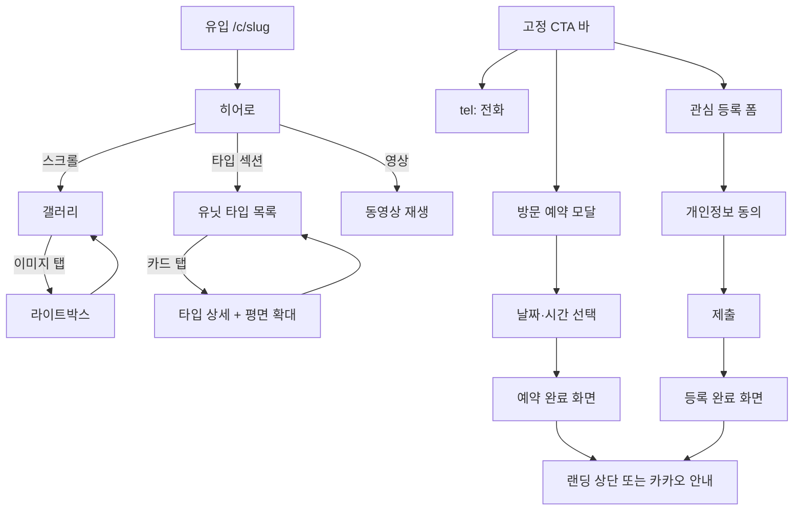

# PropLanding — UX·UI 설계서

> 관련 문서: [문서 허브](./README.md) · [룰](./rules.md) · [플랜](./implementation-plan.md) · [아키텍처](./architecture.md)

분양 랜딩은 **텍스트보다 그래픽이 전환을 결정**합니다.  
본 설계서는 시각 중심 경험과 **모든 클릭이 목적지로 이어지는** 내비게이션을 정의합니다.

---

## 1. 설계 목표

| 목표 | 설명 |
|------|------|
| **Visual-first** | 히어로·갤러리·평면도·동영상이 1차 정보 전달 수단 |
| **Click-complete** | 버튼·카드·메뉴·이미지 탭마다 명확한 다음 화면 |
| **Copyright-safe** | 레이아웃·컴포넌트·카피를 독자 설계 (벤치마크 복제 금지) |
| **Ops-ready** | 운영자가 코드 없이 그래픽·문구·순서를 교체 |

---

## 2. 그래픽 우선 설계 (Graphics-first)

### 2.1 분양에서 그래픽이 중요한 이유

- 첫 3초 **히어로 이미지**로 사업지 인상이 결정됨
- **평면도·조감도**가 타입 선택의 핵심 근거
- **슬라이드·영상**이 체류 시간과 전환율에 직결
- 모바일에서 이미지 로딩 속도(LCP)가 이탈률에 영향

### 2.2 시각 계층 (Visual Hierarchy)

```text
┌─────────────────────────────────────┐
│  L1  히어로 (풀폭, 고해상도, 슬로건)   │  ← 최대 시각 무게
├─────────────────────────────────────┤
│  L2  핵심 혜택 (아이콘+짧은 카피)      │
├─────────────────────────────────────┤
│  L3  갤러리 / 슬라이더 (스와이프)      │  ← 터치·클릭 유도
├─────────────────────────────────────┤
│  L4  유닛 타입 (평면 썸네일 → 확대)    │  ← 그래픽 핵심
├─────────────────────────────────────┤
│  L5  동영상 (포스터 + 재생)           │
├─────────────────────────────────────┤
│  L6  위치·FAQ (보조 텍스트)           │
├─────────────────────────────────────┤
│  FIX  고정 CTA 바 (전화·예약·등록)    │  ← 항상 클릭 가능
└─────────────────────────────────────┘
```

### 2.3 미디어 사양 (운영·개발 공통)

| 유형 | 권장 규격 | 처리 |
|------|-----------|------|
| 히어로 | 1920×1080+, WebP/AVIF | 반응형 `srcset`, LCP preload |
| 갤러리 | 1200px 긴 변, WebP | lazy load, lightbox |
| 평면도 | PNG/SVG, 확대 가능 | 핀치줌·전체화면 모달 |
| 동영상 | HLS/YouTube embed | 포스터 이미지 필수 |
| OG/공유 | 1200×630 | SNS 미리보기 |

### 2.4 독자 디자인 토큰 (저작권 회피)

벤치마크 사이트 색·폰트·간격을 복사하지 않고 **PropLanding 토큰**을 사용합니다.

```css
/* 예시 — 실제 값은 브랜드 가이드 확정 후 적용 */
--pl-color-primary: #1a4d6d;      /* 차분한 청록 (분양 신뢰감) */
--pl-color-accent: #c9a227;        /* 포인트 골드 (혜택 강조) */
--pl-color-surface: #f8f9fa;
--pl-radius-card: 12px;
--pl-shadow-elevated: 0 8px 24px rgba(0,0,0,.08);
--pl-font-display: "Pretendard", system-ui, sans-serif;
```

- 컴포넌트 접두사: `PlHero`, `PlGallery`, `PlUnitCard` (외부 사이트 클래스명 금지)
- 섹션 ID: `pl-section-hero`, `pl-section-units` (앵커·스크롤·분석용)

### 2.5 그래픽 개선 (벤치마크 대비)

| 벤치마크 흔한 패턴 | PropLanding 개선 |
|--------------------|------------------|
| 정적 이미지 나열 | **스와이프 갤러리 + lightbox + 공유** |
| 작은 평면도 | **탭별 타입 + 핀치줌 전체화면** |
| 텍스트 위주 타입 안내 | **평면 + 면적·가격 카드 오버레이** |
| 느린 모바일 로딩 | **AVIF/WebP, CDN, skeleton UI** |
| CTA 문구 고정 | **캠페인별 A/B 카피 (데이터 기반)** |

---

## 3. 클릭 연결 맵 (Click-through Map)

**원칙: 데드 엔드(클릭해도 아무 일 없음) 금지.**  
모든 인터랙션은 화면·모달·외부 앱·전화 중 하나로 연결됩니다.

### 3.1 공개 랜딩 — 방문자 흐름



### 3.2 공개 랜딩 — 앵커·내부 링크

| 클릭 요소 | 연결 대상 |
|-----------|-----------|
| 상단 로고 | `#pl-section-hero` |
| 섹션 네비 (있을 경우) | `#pl-section-gallery`, `#pl-section-units`, `#pl-section-inquiry` |
| 타입 카드 | `/c/{slug}/units/{typeCode}` 또는 인페이지 모달 |
| 갤러리 썸네일 | Lightbox `#n` |
| FAQ 아코디언 | 동일 페이지 확장 (URL hash optional) |
| 완료 화면 «홈으로» | `/c/{slug}` |
| 완료 화면 «카카오 상담» | 외부 딥링크 (새 탭) |

### 3.3 Control Tower — 운영자 흐름

```mermaid
flowchart TD
    LOGIN[/admin/login] --> DASH[대시보드]
    DASH -->|신규 문의 카드| INQ_LIST[/admin/inquiries?status=new]
    DASH -->|캠페인 수| CAMP_LIST[/admin/campaigns]
    CAMP_LIST -->|행 클릭| CAMP_EDIT[/admin/campaigns/:id]
    CAMP_EDIT --> PREVIEW[미리보기 /c/slug?preview=token]
    CAMP_EDIT --> PUBLISH[게시 → 공개 URL]
    INQ_LIST -->|행 클릭| INQ_DETAIL[/admin/inquiries/:id]
    INQ_DETAIL --> ASSIGN[담당자 배정]
    INQ_DETAIL --> SCHED[예약 생성]
    INQ_DETAIL --> TIMELINE[활동 이력]
    SCHED --> CAL_ADMIN[/admin/appointments]
```

### 3.4 클릭 연결 체크리스트 (QA)

- [ ] 모든 버튼에 `href`, `onClick`, 또는 `disabled`+사유
- [ ] 빈 목록에도 «캠페인 만들기» 등 **다음 행동** CTA
- [ ] 404·만료 캠페인 → 안내 페이지 + 문의 링크
- [ ] 미리보기 토큰 만료 → 편집 화면으로 리다이렉트
- [ ] 모바일 고정 CTA가 키보드·safe-area와 겹치지 않음

---

## 4. 화면 목록 (Screen Inventory)

각 화면은 라우트·진입·이탈 링크를 명시합니다.  
데이터 구조는 [data-model.md](./data-model.md), API는 [implementation-plan.md](./implementation-plan.md) Phase별 정의.

### 4.1 공개 (Public)

| ID | 화면 | 라우트 | 주요 클릭 나가기 |
|----|------|--------|------------------|
| P-01 | 캠페인 랜딩 | `/c/[slug]` | CTA, 섹션 앵커, 타입 상세 |
| P-02 | 유닛 타입 상세 | `/c/[slug]/units/[code]` | 평면 확대, 관심 등록 |
| P-03 | 방문 예약 | 모달 또는 `/c/[slug]/reserve` | 날짜 선택 → 완료 |
| P-04 | 관심 등록 | 모달 또는 `/c/[slug]/register` | 동의 → 제출 → 완료 |
| P-05 | 등록/예약 완료 | `/c/[slug]/thanks` | 홈, 카카오, 전화 |
| P-06 | 비공개/만료 | `/c/[slug]/unavailable` | 본사 문의 |

### 4.2 관리자 (Control Tower)

| ID | 화면 | 라우트 | 주요 클릭 나가기 |
|----|------|--------|------------------|
| A-01 | 로그인 | `/admin/login` | 대시보드 |
| A-02 | 대시보드 | `/admin` | 캠페인·문의·예약 |
| A-03 | 캠페인 목록 | `/admin/campaigns` | 생성, 행→편집 |
| A-04 | 캠페인 편집 | `/admin/campaigns/[id]` | 탭: 기본·미디어·타입·게시 |
| A-05 | 미리보기 | 새 탭 `/c/[slug]?preview=` | 편집 복귀 |
| A-06 | 문의 목록 | `/admin/inquiries` | 필터, 행→상세 |
| A-07 | 문의 상세 | `/admin/inquiries/[id]` | 배정, 예약, 이력 |
| A-08 | 예약 관리 | `/admin/appointments` | 문의·캠페인 링크 |
| A-09 | 통계 | `/admin/reports` | 캠페인·기간 드릴다운 |
| A-10 | 설정 | `/admin/settings` | 약관, 권한, 조직 |

---

## 5. 컴포넌트 구조 (독자 설계)

```
components/
  public/
    PlHero.tsx           # 풀폭 비주얼 + 슬로건
    PlGallery.tsx        # 스와이프 + lightbox
    PlUnitGrid.tsx       # 타입 카드 그리드
    PlUnitDetail.tsx     # 평면 확대
    PlVideoBlock.tsx     # 포스터 + 플레이어
    PlStickyCta.tsx      # 고정 전환 바
    PlInquiryForm.tsx    # 관심 등록
    PlReserveForm.tsx    # 방문 예약
  admin/
    PlCampaignWizard.tsx # 단계별 생성
    PlMediaUploader.tsx  # 드래그·크롭·미리보기
    PlInquiryTimeline.tsx
```

블록 타입 ↔ 컴포넌트 매핑은 `site_blocks.type`과 1:1 ([data-model.md](./data-model.md)).

---

## 6. 저작권 회피 — UI·UX 변경 요약

| 제거·변경 | 대체 |
|-----------|------|
| 벤치마크와 동일한 섹션 순서·명칭 | PropLanding 섹션 ID·한글 카피 독자 작성 |
| 특정 사이트 레이아웃 복제 | 카드형 유닛 그리드 + 스티키 CTA (업계 공통 패턴) |
| 외부 사이트 스크린샷·에셋 | **고객 제공 또는 라이선스 스톡**만 사용 |
| 동일 아이콘·일러스트 세트 | Lucide/Heroicons + 자체 토큰 |
| «관심고객 등록» 등 고정 문구 | «상담 신청», «방문 예약» 등 **캠페인별 커스텀** |

---

## 7. 접근성·성능 (그래픽과 양립)

- 모든 장식 이미지에 `alt` (캠페인 편집 시 필수 입력)
- 포커스 링·키보드로 CTA·갤러리 조작 가능
- LCP &lt; 2.5s (모바일 4G 기준 목표)
- CLS 방지: 이미지 `width`/`height` 또는 aspect-ratio 예약

---

*다음: [rules.md](./rules.md) · [implementation-plan.md](./implementation-plan.md)*
