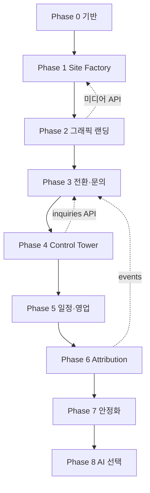

# PropLanding — 구현 플랜 (8단계 코딩 로드맵)

> 관련 문서: [문서 허브](./README.md) · [설계](./design.md) · [룰](./rules.md) · [아키텍처](./architecture.md)

**안정성 · 확장성 · 효율성**을 중심으로, 코딩을 **총 8단계**(0~7 필수 + 8 선택)로 나눕니다.  
각 단계는 **이전 단계가 배포 가능한 상태**일 때만 시작합니다.

---

## 1. 왜 8단계인가

| 고려 | 설명 |
|------|------|
| **그래픽·전환** | 분양 랜딩은 Phase 2~3에서 별도 집중 (미디어 파이프라인 선행) |
| **클릭 완결성** | Phase 3에서 공개 흐름 E2E 완성 후 운영 콘솔 연동 |
| **안정성** | Phase 7을 별도로 두어 기능 개발과 운영 성숙도 분리 |
| **확장성** | Phase 0~1에서 플러그인형 블록·API 버전·마이그레이션 기반 |
| **리스크** | 단계마다 배포·검증 → 롤백 단위가 작음 |

8단계 미만이면 그래픽·CRM·분석·DR이 한꺼번에 섞여 품질이 떨어지고,  
10단계 이상이면 초기 가시성이 늦어집니다.

---

## 2. 단계 개요

```mermaid
gantt
    title PropLanding 코딩 단계 (순서 고정)
    dateFormat X
    axisFormat %s

    section 필수
    Phase 0 기반 구축           :p0, 0, 1
    Phase 1 Site Factory 코어   :p1, after p0, 1
    Phase 2 공개 랜딩 그래픽    :p2, after p1, 1
    Phase 3 전환·문의           :p3, after p2, 1
    Phase 4 Control Tower       :p4, after p3, 1
    Phase 5 일정·영업           :p5, after p4, 1
    Phase 6 Attribution         :p6, after p5, 1
    Phase 7 안정화·운영         :p7, after p6, 1

    section 선택
    Phase 8 지능 보조           :p8, after p7, 1
```

| Phase | 명칭 | 배포 목표 | 안정성 | 확장성 | 효율성 |
|-------|------|-----------|--------|--------|--------|
| **0** | 기반 구축 | 빈 헬스체크 API | CI, IaC 시드 | 모노레포·마이그레이션 | 공통 패키지 |
| **1** | Site Factory | 캠페인 draft 저장 | 트랜잭션·검증 | 블록 타입 플러그인 | 템플릿 1종 |
| **2** | 공개 랜딩 | `/c/slug` 그래픽 | CDN·이미지 fallback | 블록 추가만으로 섹션 확장 | WebP·lazy |
| **3** | 전환·문의 | 클릭→완료 E2E | 멱등·동의 저장 | 폼 필드 스키마화 | 고정 CTA 재사용 |
| **4** | Control Tower | 운영자 CRUD | RBAC·감사 | 캠페인·문의 API 완결 | 대시보드 집계 |
| **5** | 일정·영업 | 예약·상태 머신 | 배정 규칙 테스트 | 상태 전환 플러그인 | 타임라인 UI |
| **6** | Attribution | UTM·리포트 | 이벤트 버퍼·DLQ | 이벤트 스키마 버전 | 배치 집계 |
| **7** | 안정화·운영 | SLA·DR | 백업·복구 리허설 | 무중단 마이그레이션 | 캐시·오토스케일 |
| **8** | 지능 보조 (선택) | 스코어·분류 | AI 실패 시 폴백 | 모델 버전 분리 | 비동기 큐 |

---

## 3. 비기능 요구사항 (설계 기준)

### 3.1 안정성

- 헬스체크, 서킷 브레이커(외부 연동), 재시도·DLQ
- 문의 제출 **유실 0건** (DB 커밋 전 성공 응답 금지)
- Phase 7: 백업 복구 리허설, 카오스/부하 테스트

### 3.2 확장성

| 유형 | 구현 |
|------|------|
| 기능 추가 | `site_blocks.type` + React 컴포넌트 레지스트리 |
| 기능 수정 | draft/publish, API v1 유지 |
| 기능 삭제 | soft delete + deprecated 기간 |
| 데이터 업데이트 | forward-only 마이그레이션 + 호환 레이어 |
| 장애 복구 | PITR, 스토리지 버전닝, runbook |
| 사후관리 | [rules.md §9](./rules.md#9-사후관리-maintenance) |

### 3.3 효율성

- Published 캠페인: ISR/SSG + CDN
- Admin: SSR + API pagination
- 이미지: 업로드 시 다중 해상도 생성
- 리포트: materialized view 또는 nightly batch

---

## 4. 단계별 코딩 로드맵 (8단계)

### Phase 0 — 기반 구축

**목표:** 개발·배포·관측 골격

| 작업 | 산출물 |
|------|--------|
| 모노레포 (apps/web, apps/admin, packages/api) | `pnpm-workspace` |
| PostgreSQL + 마이그레이션 도구 | `schema` v0 |
| Docker Compose (local) | `docker-compose.yml` |
| CI: lint, test, build | GitHub Actions |
| `/health`, `/ready` | API |
| 환경 변수·시크릿 규칙 | `.env.example` |

**완료 기준:** main 브랜치 merge 시 스테이징 자동 배포, 헬스 200

**문서:** [architecture.md §6](./architecture.md#6-시스템-아키텍처), [rules.md §7](./rules.md#7-git코드-품질)

---

### Phase 1 — Site Factory 코어

**목표:** 캠페인·블록·미디어 **데이터 모델**과 API

| 작업 | 산출물 |
|------|--------|
| `organizations`, `campaigns`, `site_blocks`, `media_assets` | 마이그레이션 |
| CRUD API `/api/v1/campaigns` | OpenAPI |
| S3 업로드 (서명 URL) | 미디어 파이프라인 v1 |
| 블록 타입: `hero`, `gallery`, `raw_text` | 레지스트리 |
| Admin 스켈레톤 (목록만) | `/admin/campaigns` |

**확장성:** 새 섹션 = 블록 타입 1개 추가

**완료 기준:** draft 캠페인 생성·이미지 업로드·JSON 조회

---

### Phase 2 — 공개 랜딩 (그래픽 집중)

**목표:** [design.md §2](./design.md#2-그래픽-우선-설계-graphics-first) 시각 경험

| 작업 | 산출물 |
|------|--------|
| `/c/[slug]` SSG/ISR | Public app |
| `PlHero`, `PlGallery` (lightbox), `PlStickyCta` | 컴포넌트 |
| `PlUnitGrid`, `PlUnitDetail` (평면 확대) | 타입 UI |
| `PlVideoBlock` | 영상 |
| 반응형 이미지·skeleton·LCP 최적화 | 성능 |
| `?preview=token` | 미리보기 |

**클릭 연결:** 갤러리→lightbox, 타입 카드→상세, CTA→모달/섹션 ([design.md §3](./design.md#3-클릭-연결-맵-click-through-map))

**완료 기준:** 그래픽만으로 정보 전달, Lighthouse 모바일 성능 80+

---

### Phase 3 — 전환·문의 (클릭 흐름 완결)

**목표:** 방문자 **클릭→완료** E2E

| 작업 | 산출물 |
|------|--------|
| `inquiries`, `inquiry_consents`, `legal_notices` | DB |
| `PlInquiryForm`, `PlReserveForm` | UI |
| `/c/[slug]/thanks` | 완료 화면 |
| `tel:` 고정 CTA | 전화 연결 |
| 제출 API + 트랜잭션 | `/api/v1/inquiries` |
| 기본 `analytics_events` (cta_click, form_submit) | 이벤트 시드 |

**안정성:** 제출 실패 시 재시도 UI, 중복 제출 방지

**완료 기준:** [design.md §3.1](./design.md#31-공개-랜딩--방문자-흐름) 플로우 전부 연결

---

### Phase 4 — Control Tower

**목표:** 운영자가 **클릭만으로** 캠페인·문의 관리

| 작업 | 산출물 |
|------|--------|
| Auth + RBAC | `admin_users`, `roles` |
| 대시보드 → 문의·캠페인 드릴다운 | [design.md §3.3](./design.md#33-control-tower--운영자-흐름) |
| 캠페인 편집 마법사 (탭: 기본·미디어·타입·게시) | A-04 |
| 문의 목록·상세·타임라인 | A-06, A-07 |
| 게시 `published` + CDN 무효화 | publish flow |

**완료 기준:** 코드 없이 캠페인 1개 생성→게시→문의 확인

---

### Phase 5 — 일정·영업

**목표:** Inquiry Hub · Schedule Desk

| 작업 | 산출물 |
|------|--------|
| 상태 머신 ([architecture.md §9](./architecture.md#9-잠재고객-상태-머신-inquiry-lifecycle)) | `inquiry_events` |
| `appointments`, `consultations` | DB + API |
| 담당자 배정 (round-robin) | `assignment_rules` |
| `/admin/appointments` 캘린더 | A-08 |
| 중복 연락처 탐지 | 서비스 |

**확장성:** 상태·배정 규칙은 설정 테이블로 분리

**완료 기준:** 문의→배정→예약→상담기록→상태 변경 E2E

---

### Phase 6 — Attribution

**목표:** 마케팅 성과·행동 추적

| 작업 | 산출물 |
|------|--------|
| `visitor_sessions`, `utm_campaigns` | DB |
| UTM 파싱·first touch | 미들웨어 |
| 이벤트: `unit_type_view`, `media_play` | 클라이언트 SDK |
| `/admin/reports` | A-09 |
| Inquiry 360° 뷰 ([architecture.md §8.2](./architecture.md#82-잠재고객-360-뷰-운영자-화면-예시)) | A-07 확장 |

**개인정보:** 동의 전 익명 세션만 ([rules.md §8](./rules.md#8-보안개인정보))

**완료 기준:** 캠페인·UTM별 전환 리포트

---

### Phase 7 — 안정화·운영 (필수 마무리)

**목표:** 프로덕션 **안정성·장애 복구·사후관리**

| 작업 | 산출물 |
|------|--------|
| DB 자동 백업 + 복구 runbook | 문서 + 검증 |
| Sentry·메트릭·알림 | 관측 |
| 부하 테스트 (피크 문의) | k6 리포트 |
| WAF·rate limit·CSRF | 보안 |
| 무중단 배포 (blue/green 또는 rolling) | CI/CD |
| 스토리지 GC·로그 로테이션 | cron |
| «점검 중» 정적 페이지 | CDN fallback |

**완료 기준:** RPO/RTO 목표 달성 리허설 1회, [rules.md §5](./rules.md#5-안정성장애-복구-룰) 체크

---

### Phase 8 — 지능 보조 (선택)

**전제:** Phase 5~6 데이터 3개월+ 축적

| 작업 | 산출물 |
|------|--------|
| 문의 분류·요약 (LLM) | 비동기 워커 |
| 리드 스코어 | 규칙 + ML |
| 우선순위 큐 | Admin UI |

**안정성:** AI 실패 시 수동 워크플로 폴백 필수

---

## 5. 단계 간 의존성

**병렬 불가:** Phase 2(그래픽)는 Phase 1 미디어 API 없이 시작하지 않음.  
**병렬 가능:** Phase 7 일부(모니터링)는 Phase 4부터 점진 도입.

---

## 6. 단계별 클릭·그래픽 검증

| Phase | 그래픽 검증 | 클릭 검증 |
|-------|-------------|-----------|
| 2 | 히어로·갤러리·평면 품질 | 갤러리·타입·CTA |
| 3 | 완료 화면 비주얼 | 폼→동의→완료→홈 |
| 4 | Admin 미디어 업로드 미리보기 | 대시보드→상세→복귀 |
| 5 | 캘린더 UI | 문의→예약→캘린더 |
| 7 | CDN 장애 시 fallback | 전 링크 회귀 테스트 |

---

## 7. 기술 스택 확정 (Phase 0에서 결정)

| 영역 | 권장 |
|------|------|
| Framework | Next.js 14+ (App Router) |
| API | NestJS 또는 Next Route Handlers + 서비스 레이어 |
| ORM | Prisma |
| DB | PostgreSQL 15+ |
| Storage | S3 호환 + CloudFront |
| Queue (Phase 6+) | BullMQ / SQS |
| CI/CD | GitHub Actions → Vercel/Railway/AWS |

---

## 8. 첫 스프린트 제안 (Phase 0 + 1 일부)

1. 저장소 스캐폴딩 + Docker Postgres  
2. `campaigns` / `site_blocks` 마이그레이션  
3. 캠페인 CRUD API  
4. 이미지 업로드 1종  
5. `/health` 스테이징 배포  

→ 이후 **Phase 2 그래픽**에 전념 ([work-summary.md](./work-summary.md))

---

*이전: [design.md](./design.md) · [rules.md](./rules.md) · 다음: [work-summary.md](./work-summary.md)*
